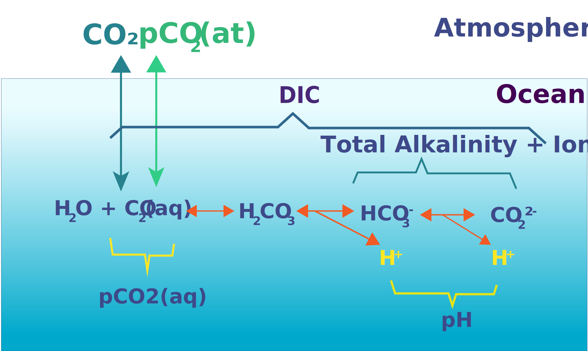

# 🌊 Marine Carbonate System Visualizer

Interactive **Bjerrum plot visualizations** for learning marine carbonate chemistry. Essential for studying ocean acidification, coral reef health, and marine ecosystem responses to climate change.

    

    <strong>Comprehensive visualization tools for marine carbonate chemistry education</strong>

---

## 🚀 **Quick Start - Choose Your Tool**

### 📱 **Interactive Applications (Voilà Interface)**
- **🧪 TA-DIC System**: [Complete Carbonate Explorer](https://mybinder.org/v2/gh/gilbertoCM/marine_carbonate_visualizer/main?urlpath=voila%2Frender%2Fmarine_carbonate_TA_DIC.ipynb)
- **🌊 TA-pCO2 System**: [Ocean Acidification Explorer](https://mybinder.org/v2/gh/gilbertoCM/marine_carbonate_visualizer/main?urlpath=voila%2Frender%2Fmarine_carbonate_TA_pCO2.ipynb)  
- **⚖️ TA-pH System**: [pH Control Explorer](https://mybinder.org/v2/gh/gilbertoCM/marine_carbonate_visualizer/main?urlpath=voila%2Frender%2Fmarine_carbonate_TA_pH.ipynb)

### 📓 **Want to See and Edit the Code?**
- **👨‍💻 Full Jupyter Lab**: [Access All Notebooks](https://mybinder.org/v2/gh/gilbertoCM/marine_carbonate_visualizer/main) 
- **🔧 Edit Your Own Conditions**: Modify parameters, constants, and calculations

## 📊 **What You'll See**
Each tool shows a **4-panel Bjerrum plot**:
1. **📈 Bjerrum Plot** - How pH controls carbonate species (CO₂, HCO₃⁻, CO₃²⁻)
2. **🥧 Current Composition** - Pie chart of species at current pH
3. **⚖️ Aragonite Saturation** - Shell/coral formation potential (Ω value)
4. **📋 System Parameters** - All your inputs and calculated results

## ⚗️ **Technology**
Uses **[PyCO2SYS](https://github.com/mvdh7/PyCO2SYS)** - the same software used by oceanographic researchers worldwide.

## 🔧 **If Binder Gets Stuck**
- **Wait patiently** - First load can take 2-5 minutes depending on server
- **Click badge again** if it shows "Building..." for more than 3 minutes
- **Clear browser cache** (Ctrl+F5) and retry
- **Alternative**: Use [Jupyter Lab](https://mybinder.org/v2/gh/gilbertoCM/marine_carbonate_visualizer/main) for full access

---

## 👤 **Author**
**José-Gilberto Cardoso-Mohedano** | [ORCID: 0000-0002-2918-972X](https://orcid.org/0000-0002-2918-972X)  
Instituto de Ciencias del Mar y Limnología, UNAM | Ciudad del Carmen, México

## 📚 **License**
 Non-commercial use with attribution.
